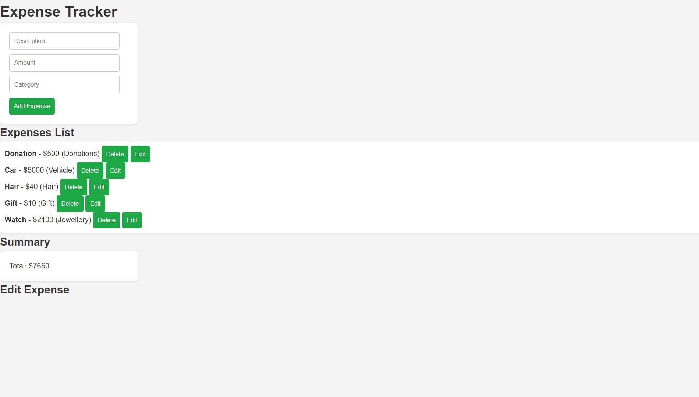

# Expense Tracker Web Application

A simple and user-friendly web application for tracking personal expenses. Users can add, update, delete, and view expenses, as well as view a summary of expenses for specific months. The app is built with Node.js, Express, MongoDB, and vanilla JavaScript (with Fetch API for frontend-to-backend communication).

## Features

- **Add Expenses**: Users can add expenses by providing a description, amount, and category.
- **Edit Expenses**: Existing expenses can be updated with new details.
- **Delete Expenses**: Users can delete any expense.
- **View All Expenses**: Users can view a complete list of expenses.
- **Monthly Summary**: Users can view a summary of expenses for a specific month.
- **Expense Categories**: Filter expenses by category.
- **Responsive Design**: The app is responsive and works well on different devices.
- **Security**: Environment variables are used to store sensitive information like the MongoDB URI.

## Technologies Used

- **Frontend**:
  - HTML
  - CSS (flexbox-based layout, hover effects, and responsive design)
  - JavaScript (DOM manipulation, Fetch API)
  
- **Backend**:
  - Node.js
  - Express.js (REST API)
  - MongoDB (NoSQL Database)

## Project Structure

Below is the structure of the `expense-tracker` project:

```plaintext
expense-tracker/
│
├── client/
│   ├── index.html        # Frontend HTML
│   ├── styles.css        # CSS for styling
│   └── app.js            # JavaScript logic (Add, Edit, Delete expenses)
│
├── server/
│   ├── server.js         # Backend server and route configuration
│   └── routes/
│       └── expenseRoutes.js  # Routes for expense management (CRUD)
│
├── models/
│   └── Expense.js        # Mongoose model for expense schema (optional if using Mongoose)
│
├── .env                  # Environment variables (not tracked in Git)
├── .gitignore            # Git ignore rules
├── README.md             # Project documentation
└── package.json          # Project metadata and dependencies
```
## Installation

### Prerequisites

Ensure you have the following installed:
- **Node.js** (v12 or higher)
- **MongoDB** (A MongoDB instance or MongoDB Atlas)

### Setup Instructions

1. Clone the repository:
   ```bash
   git clone https://github.com/yourusername/expense-tracker.git
   cd expense-tracker

2. Install the necessary dependencies:

```bash
  npm install
  Create a .env file in the project root:
```
```bash
  MONGO_URI=mongodb+srv://<username>:<password>@cluster0.mongodb.net/mydatabase?retryWrites=true&w=majority
```
  Replace `<username>`, `<password>`, and `mydatabase` with your MongoDB credentials.


## Usage
Add an Expense: Use the form on the main page to add a new expense. Provide a description, amount, and category.
Edit an Expense: Click the Edit button next to any expense to modify its details.
Delete an Expense: Click the Delete button next to any expense to remove it.
View Expenses: The expenses list will automatically refresh as new expenses are added, updated, or deleted.
View Summary: The total of all expenses is displayed in the summary section.

## Deployemnt
To deploy this project on a cloud provider like Heroku or Vercel, follow these steps:
Add your environment variables (MONGO_URI) to the platform’s environment configuration (e.g., via Heroku’s Config Vars).
Push your project to the platform using their deployment tools (e.g., Heroku CLI or GitHub Actions).

## Screenshots
### Main Page


## Security
To keep sensitive information secure:

The .env file contains the MongoDB URI and should not be committed to Git. Ensure it is in .gitignore.
The app is configured to use environment variables, ensuring sensitive credentials are not exposed.

## Future Enhancements
* User Authentication: Allow users to log in and manage their own expenses.
* Charts and Graphs: Visual representation of expenses over time.
* Recurring Expenses: Allow users to add recurring expenses (e.g., monthly bills).
* Export to CSV: Add a feature to export expense data to a CSV file.
